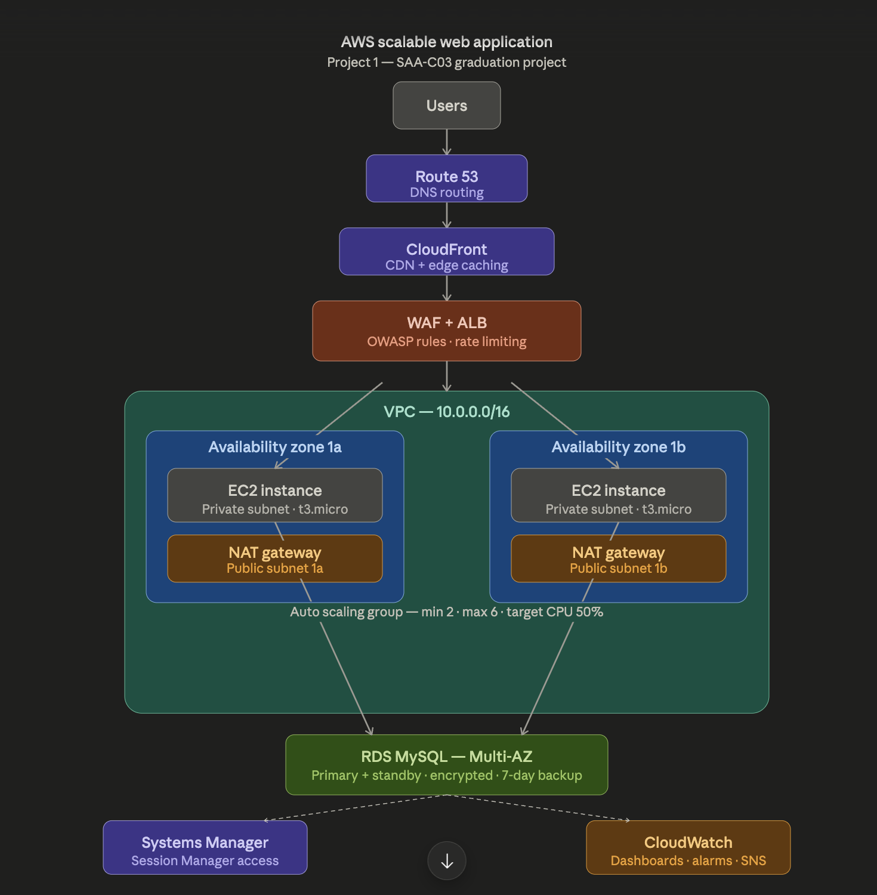

# 🚀 AWS Scalable Web Application

> Production-grade scalable web application on AWS — SAA-C03 Graduation Project

---

## 📐 Architecture

---

## 🌍 Live Demo

| Endpoint | URL |
|----------|-----|
| ALB (direct) | http://scalable-web-app-alb-1562775529.us-east-1.elb.amazonaws.com |
| CloudFront (CDN) | https://d4swcrka279hq.cloudfront.net |

---

## 🛠️ AWS Services Used

| Category | Services |
|----------|----------|
| Networking | VPC, Public & Private Subnets, NAT Gateway, Internet Gateway, Security Groups, NACLs |
| Compute | EC2 (Amazon Linux 2023), Auto Scaling Group, Launch Template |
| Load Balancing | Application Load Balancer (ALB) |
| Security | WAF (OWASP rules), IAM Roles, KMS Encryption |
| Database | RDS MySQL 8.0 Multi-AZ |
| CDN | CloudFront |
| DNS | Route 53 |
| Monitoring | CloudWatch Dashboards, Alarms, SNS Notifications |
| Access | Systems Manager Session Manager (no SSH) |

---

## 📁 Repository Structure